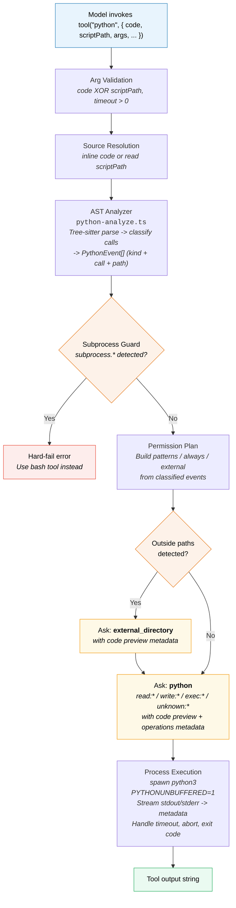

# opencode-python-tool

Custom [OpenCode](https://opencode.ai) `python` tool with static AST-based
classification, permission-aware execution, and defensive runtime behavior for
headless/non-interactive agent workflows.

## Overview

This repository provides a drop-in custom `python` tool for OpenCode. It is
designed for cases where Python execution is the primary action and you want
stronger permission controls than ad-hoc shell execution.

Use this project when you need:

- **Pre-execution static analysis** of Python source via Tree-sitter AST
  parsing, classifying every call into `read`, `write`, `emit`, `exec`,
  `pure`, or `unknown` events.
- **Explicit permission asks** (`python` + `external_directory`) before any code
  runs, with structured metadata including code preview, event patterns,
  always-allow suggestions, and non-blocking `emit`/`pure` observability.
- **Guardrails for high-risk execution paths** -- subprocess invocations are
  hard-blocked, dangerous builtins and deserialization calls are denied by
  default.
- **SDK-aware classification** for OCI, GitHub API (ghapi), and
  Atlassian (atlassian-python-api) client libraries.
- **Repeatable tests** around analyzer, runtime, and session-review workflows.

## Architecture



## Repository File Map

### Canonical source (`src/`)

| File | Purpose |
|------|---------|
| `src/python.ts` | Runtime entry point: arg validation, source loading, analyzer call, permission asks, subprocess guard, process execution, timeout/abort handling, metadata streaming. |
| `src/python/python-analyze.ts` | Tree-sitter analyzer that classifies Python calls into `read \| write \| emit \| exec \| pure \| unknown` events with optional path extraction. Loads cached declarative rules from `src/python/python-rules.json` and keeps procedural heuristics in TypeScript. |
| `src/python/python-rules.json` | Declarative call/method/path rule inventory consumed by the analyzer. `candidates.unknown` is review-only evidence, not live classification. |
| `src/python/python.txt` | Tool prompt that guides model usage (`code` vs `scriptPath`, non-interactive constraints, safety behavior). |
| `src/python/env.d.ts` | `*.txt` module typing for TypeScript imports. |
| `src/python-session-report.ts` | Saved-session utility that re-analyzes inline Python snippets from the OpenCode SQLite database and can update `candidates.unknown` in the rules file. |

### OpenCode entrypoints (`.opencode/tool/`)

Thin re-export wrappers so OpenCode discovers the tool:

| File | Re-exports |
|------|------------|
| `.opencode/tool/python.ts` | `export { default } from "../../src/python"` |
| `.opencode/tool/python-analyze.ts` | `export * from "../../src/python/python-analyze"` |

### Configuration and tests (`.opencode/`)

| File | Purpose |
|------|---------|
| `.opencode/opencode.jsonc` | Restrictive default permission policy. |
| `.opencode/package.json` | Dependencies: `@opencode-ai/plugin`, `tree-sitter-python`, `web-tree-sitter`. |
| `.opencode/test/python-analyze.test.ts` | Analyzer unit tests (13 describe blocks, comprehensive classification coverage). |
| `.opencode/test/python.test.ts` | Runtime/integration tests (arg validation, permissions, external directory, streaming, timeout, abort). |
| `.opencode/test/python-session-report.test.ts` | Saved-session report regression tests (scan, filtering, malformed-row handling, candidate updates). |
| `.opencode/test/fixtures/context.ts` | Mock `ToolContext` fixture for tests. |

## Requirements

| Requirement | Details |
|-------------|---------|
| **OpenCode** | Custom tools enabled in your target project. |
| **Bun** | Required to install deps and run tests. |
| **Python 3** | Available at runtime as `python3`, or set `OPENCODE_PYTHON_BIN`. |
| **Node-compatible runtime** | For OpenCode plugin execution. |

## Setup (This Repository)

Install dependencies:

```bash
cd .opencode
bun install
```

Quick load check:

```bash
cd .opencode
bun -e "import('./tool/python.ts').then(() => console.log('module loads ok'))"
```

## Installation Into Another Project

### Option 1: Tool-only install (minimal)

The runtime wrappers in `.opencode/tool/` import canonical sources from `src/`,
so both paths must exist in the destination.

```bash
SRC="/path/to/opencode-python-tool"
DST="/path/to/target-repo"

mkdir -p "$DST/.opencode/tool" "$DST/src/python"

cp "$SRC/src/python.ts" "$DST/src/python.ts"
cp "$SRC/src/python/python-analyze.ts" "$DST/src/python/python-analyze.ts"
cp "$SRC/src/python/python-rules.json" "$DST/src/python/python-rules.json"
cp "$SRC/src/python/python.txt" "$DST/src/python/python.txt"
cp "$SRC/src/python/env.d.ts" "$DST/src/python/env.d.ts"

cp "$SRC/.opencode/tool/python.ts" "$DST/.opencode/tool/python.ts"
cp "$SRC/.opencode/tool/python-analyze.ts" "$DST/.opencode/tool/python-analyze.ts"
```

In `$DST/.opencode/package.json`, ensure these dependencies exist:

```json
{
  "dependencies": {
    "@opencode-ai/plugin": "1.2.15",
    "tree-sitter-python": "0.25.0",
    "web-tree-sitter": "0.25.10"
  }
}
```

Install dependencies and smoke-check module loading:

```bash
cd "$DST/.opencode"
bun install
bun -e "import('./tool/python.ts').then(() => console.log('module loads ok'))"
```

Notes:

- Merge dependency entries into your existing `.opencode/package.json`; do not
  overwrite unrelated tool dependencies.
- Do not copy `.opencode/tool/python.txt` from this repo; prompt text lives
  in `src/python/python.txt`.
- Ensure your target config also includes the recommended `permission.python`
  and `external_directory` rules from this README.

### Option 2: Install with tests (recommended for maintainers)

In addition to Option 1, copy test files and run validation:

```bash
mkdir -p "$DST/.opencode/test/fixtures"
cp "$SRC/.opencode/test/python-analyze.test.ts" "$DST/.opencode/test/python-analyze.test.ts"
cp "$SRC/.opencode/test/python.test.ts" "$DST/.opencode/test/python.test.ts"
cp "$SRC/.opencode/test/python-session-report.test.ts" "$DST/.opencode/test/python-session-report.test.ts"
cp "$SRC/.opencode/test/fixtures/context.ts" "$DST/.opencode/test/fixtures/context.ts"

cd "$DST/.opencode"
bun test test/python-analyze.test.ts
bun test test/python.test.ts
bun test
```

### Option 3: Global OpenCode install (`~/.config/opencode`)

Use this when your custom tools live in the global OpenCode config instead of a
project-local `.opencode/` folder.

```bash
SRC="/path/to/opencode-python-tool"
OPENCODE_HOME="${OPENCODE_HOME:-$HOME/.config/opencode}"

mkdir -p "$OPENCODE_HOME/tools/python"

cp "$SRC/src/python.ts" "$OPENCODE_HOME/tools/python.ts"
cp "$SRC/src/python/python-analyze.ts" "$OPENCODE_HOME/tools/python/python-analyze.ts"
cp "$SRC/src/python/python-rules.json" "$OPENCODE_HOME/tools/python/python-rules.json"
cp "$SRC/src/python/python.txt" "$OPENCODE_HOME/tools/python/python.txt"
cp "$SRC/src/python/env.d.ts" "$OPENCODE_HOME/tools/python/env.d.ts"
```

Global installs use package-based imports. Ensure this line exists in
`$OPENCODE_HOME/tools/python.ts`:

```ts
import { tool } from "@opencode-ai/plugin"
```

Then install dependencies and smoke-check:

```bash
cd "$OPENCODE_HOME"
bun install
bun -e "import('./tools/python.ts').then(() => console.log('python tool loads ok'))"
```

## Recommended Permission Configuration

Add these rules under `permission` in your OpenCode config (`opencode.jsonc`):

```jsonc
{
  "permission": {
    "python": {
      "*": "ask",
      "exec:eval": "deny",
      "exec:exec": "deny",
      "exec:compile": "deny",
      "exec:subprocess": "deny",
      "exec:__import__": "deny",
      "exec:os.system": "deny",
      "exec:os.popen": "deny",
      "exec:os.exec*": "deny",
      "exec:pickle.load": "deny",
      "exec:pickle.loads": "deny",
      "exec:marshal.load": "deny",
      "exec:marshal.loads": "deny",
      "unknown:*": "ask"
    },
    "external_directory": "ask"
  }
}
```

> **Note:** This matches the shipped `.opencode/opencode.jsonc` exactly. The
> `exec:subprocess` deny is a defense-in-depth complement to the runtime
> subprocess hard-fail guard.

Operational guidance:

| Rule | Rationale |
|------|-----------|
| `python:*` = `ask` | Forces explicit human review for all classified operations. |
| `exec:eval`, `exec:exec`, `exec:compile`, `exec:__import__` = `deny` | Blocks dynamic code execution that bypasses static analysis. |
| `exec:subprocess` = `deny` | Defense-in-depth alongside the runtime subprocess guard. |
| `exec:os.system`, `exec:os.popen`, `exec:os.exec*` = `deny` | Blocks shell/process spawning that should use the `bash` tool. |
| `exec:pickle.*`, `exec:marshal.*` = `deny` | Blocks dangerous deserialization (arbitrary code execution risk). |
| `unknown:*` = `ask` | Prevents auto-approving unanalyzed or unrecognized behavior. |
| `external_directory` = `ask` | Prevents silent cross-worktree file access. |

## OpenCode Fork: Enhanced TUI Permission Rendering

This tool works fully with **stock/upstream OpenCode** — no fork is required for
core functionality. Arg validation, AST analysis, permission asks, subprocess
guarding, and process execution all operate correctly on any OpenCode
installation that supports custom tools.

A companion fork of OpenCode adds **Python-specific TUI enhancements** to the
permission prompt rendering. These changes improve the operator experience when
reviewing `python` and `external_directory` permission asks but do not affect
runtime behavior or security posture.

### Comparison: Stock vs Forked OpenCode

| Capability | Stock OpenCode | Forked OpenCode |
|------------|----------------|-----------------|
| **Permission prompt rendering** | Generic/fallback prompt — shows permission patterns (`read:*`, `exec:*`, etc.) and Allow/Reject actions. No Python-specific context. | Python-specific compact summary showing description, mode (`inline`/`script`), script path, args, workdir, and code preview with line/byte counts. |
| **Code preview in prompt body** | Not rendered. Metadata is sent by the tool but the stock TUI does not display it. | Compact code preview displayed inline with truncation status. |
| **`ctrl+f` fullscreen view** | Generic permission info. | Full Python source code with precedence: `codeExpanded` (≤50 KB) → inline `code` → `codePreview` fallback. |
| **`external_directory` context** | Generic directory information. | Python-aware context showing mode, description, and source preview alongside directory details. |
| **Config schema for `python` key** | Works at runtime via `.catchall()` but `python` does not appear in config schema autocompletion. | `python` registered as a named permission key — editors provide autocompletion for `permission.python.*` rules. |

### Fork status

- The fork lives at `./opencode` in this repository (gitignored; not shipped).
- Implementation commits: `bdc1d13` (renderer + helper), `9f1bb60` (config
  schema registration).
- Focused tests pass: 69 pass, 0 fail (permission-python + config suites).
- Full fork test suite: 1180 pass, 5 skip, 0 fail.
- Phase 4 (isolated tmux E2E validation) and Phase 5 (PR packaging) are still
  TODO before upstream submission.
- PR plan: `docs/opencode-tui-python-permission-pr-plan.md`.

### Using the fork

**Option A — Local launcher:** Build the fork source and set up an
`opencode-fork` alias/script that runs from `./opencode`. This gives the
enhanced TUI immediately.

**Option B — Wait for upstream merge:** Continue using stock OpenCode. Once the
fork changes are accepted upstream, the enhanced rendering becomes available
automatically on upgrade. No changes to this tool or its configuration are
needed either way.

## Security Rationale

The default deny statements block high-risk execution paths that are difficult
to review safely in an automated flow.

### Why these denies matter

| Category | Calls | Risk |
|----------|-------|------|
| **Dynamic execution** | `eval`, `exec`, `compile`, `__import__` | Arbitrary code execution or dynamic module loading bypasses static intent review. |
| **Process spawning** | `subprocess.*`, `os.system`, `os.popen`, `os.exec*` | Spawns or replaces processes, executes shell commands, bypasses non-terminal safety boundary. |
| **Unsafe deserialization** | `pickle.load/loads`, `marshal.load/loads` | Deserializes untrusted data into executable behavior (known arbitrary code execution vector). |

### Concrete risk examples (if denies are removed)

- A seemingly harmless script can pull a payload string from disk/network and
  run it via `exec`, bypassing static call-level intent checks.
- Shell-capable calls can chain from Python into broader system operations that
  should instead be reviewed through the `bash` tool boundary.
- Unsafe deserialization can execute attacker-controlled object constructors at
  load time.

### Least-privilege recommendations

1. Start from deny + ask defaults and only relax one pattern at a time.
2. Scope approvals narrowly (specific calls/paths); avoid global wildcards.
3. Require explicit human review for new `exec:*` patterns.
4. Periodically re-audit policy exceptions after incident/near-miss events.

## Analyzer Classification Reference

The static analyzer (`python-analyze.ts`) uses Tree-sitter to parse Python
source and classify every function call into one of six event kinds:

### Event kinds

| Kind | Meaning | Permission prefix |
|------|---------|-------------------|
| `read` | File/data read operation | `read:` |
| `write` | File/data write operation | `write:` |
| `emit` | Outward reporting/signaling (stdout/logging/metrics) without durable state mutation | `emit:` |
| `exec` | Process spawn, dynamic execution, network, database, or dangerous API call | `exec:` |
| `pure` | In-memory-only computation with no external interaction | `pure:` |
| `unknown` | Unrecognized, dynamic, or parse-error call | `unknown:` |

Runtime ask policy:

- `read`, `write`, `exec`, and `unknown` participate in `python` permission asks.
- `emit` is analyzer/report visible and included in runtime operation metadata, but non-blocking by default.
- `pure` is analyzer-visible and review-optional, but excluded from permission asks by default.

### Classification tables

#### File I/O

| Call pattern | Kind | Path extraction |
|-------------|------|-----------------|
| `open(path, 'r')` | read | Literal or dynamic path from 1st arg |
| `open(path, 'w'/'a'/'x'/'r+')` | write | Literal or dynamic path from 1st arg |
| `open(path, <dynamic_mode>)` | unknown | `open-mode-dynamic` |
| `Path(p).read_text()`, `.read_bytes()` | read | From `Path()` constructor arg |
| `Path(p).write_text()`, `.write_bytes()`, `.mkdir()`, `.unlink()`, `.touch()`, `.rename()`, `.replace()`, `.rmdir()`, `.append_text()` | write | From `Path()` constructor arg |

#### OS / shutil writes

| Call | Kind | Path source |
|------|------|-------------|
| `os.remove(path)`, `os.unlink(path)` | write | 1st positional or `path` keyword |
| `os.makedirs(name)` | write | 1st positional or `name`/`path` keyword |
| `os.rename(src, dst)`, `os.replace(src, dst)` | write | 2nd positional or `dst` keyword |
| `shutil.copy(src, dst)`, `.copy2()`, `.copytree()`, `.move()` | write | 2nd positional or `dst` keyword |
| `shutil.rmtree(path)` | write | 1st positional or `path` keyword |

#### Serialization I/O

| Call | Kind |
|------|------|
| `json.load`, `yaml.load`, `yaml.safe_load` | read |
| `json.dump`, `yaml.dump`, `yaml.safe_dump` | write |

#### Emit and pure defaults

| Call | Kind |
|------|------|
| `print`, `logging.debug/info/warning/error/critical/exception/log`, `warnings.warn` | emit |
| `re.compile`, `re.search`, `re.match`, `re.fullmatch`, `re.findall`, `re.finditer`, `re.split`, `re.escape` | pure |

`re.sub` is intentionally not classified as `pure` by default because callable replacements can hide side effects.

#### Tempfile

| Call | Kind |
|------|------|
| `tempfile.NamedTemporaryFile`, `tempfile.mkdtemp`, `tempfile.mkstemp`, `tempfile.TemporaryDirectory` | write |

#### Dangerous builtins and process execution

| Call | Kind |
|------|------|
| `eval`, `exec`, `compile`, `__import__` | exec |
| `os.system`, `os.popen`, `os.exec*` | exec |
| `subprocess.*` (any method) | exec |

#### Dangerous deserialization

| Call | Kind |
|------|------|
| `pickle.load`, `pickle.loads` | exec |
| `marshal.load`, `marshal.loads` | exec |

#### Network / HTTP

| Call | Kind |
|------|------|
| `requests.get/post/put/delete/patch/head/options` | exec |
| `urllib.request.urlopen`, `urllib.request.urlretrieve` | exec |
| `http.client.HTTPConnection`, `http.client.HTTPSConnection` | exec |
| `aiohttp.ClientSession` | exec |
| `httpx.get/post/put/delete/patch`, `httpx.Client`, `httpx.AsyncClient` | exec |
| `socket.socket`, `socket.create_connection` | exec |

#### Database

| Call | Kind |
|------|------|
| `sqlite3.connect` | exec |
| `psycopg2.connect` | exec |
| `pymysql.connect` | exec |
| `sqlalchemy.create_engine` | exec |

### SDK-specific classification

#### OCI (Oracle Cloud Infrastructure)

| Call | Kind | Notes |
|------|------|-------|
| `oci.identity.IdentityClient`, `oci.core.ComputeClient`, `oci.core.VirtualNetworkClient`, `oci.object_storage.ObjectStorageClient`, `oci.database.DatabaseClient`, `oci.secrets.SecretsClient`, `oci.key_management.KmsManagementClient` | exec | Constructor calls |
| `oci.pagination.list_call_get_all_results`, `oci.pagination.list_call_get_all_results_generator` | exec | Pagination helpers |
| `oci.<client>.<method>()` | exec | Chained client method calls via prefix matching |
| `oci.config.from_file(path)` | read | Config file read with path extraction |

#### GitHub API (ghapi)

| Call | Kind | Notes |
|------|------|-------|
| `ghapi.all.GhApi`, `ghapi.core.GhApi` | exec | Constructors; also tracked as instance sources |
| `ghapi.graphql.gh_query`, `ghapi.page.paged`, `ghapi.page.pages` | exec | Query/pagination helpers |
| `ghapi.auth.GhDeviceAuth`, `ghapi.auth.github_auth_device` | exec | Auth helpers |
| `GhApi.create_gist`, `GhApi.create_release`, `GhApi.delete_release`, `GhApi.upload_file`, `GhApi.enable_pages` | exec | Convenience methods |
| `ghapi.actions.create_workflow_files`, `ghapi.actions.create_workflow`, `ghapi.actions.gh_create_workflow` | write | Workflow file helpers |
| `<instance>.<group>.<method>()` | exec | Instance variable tracking: `api = GhApi(); api.git.get_ref()` -> `ghapi.git.get_ref` |

#### Atlassian (atlassian-python-api)

| Call | Kind | Notes |
|------|------|-------|
| `Jira()`, `Confluence()`, `Bitbucket()`, `ServiceDesk()`, `Crowd()`, `Xray()`, `CloudAdminOrgs()`, `CloudAdminUsers()` | exec | Bare constructors (require `from atlassian import ...` provenance) |
| `atlassian.Jira()`, `atlassian.confluence.Confluence()`, etc. | exec | Module-qualified constructors (always classified) |
| `<instance>.jql()`, `<instance>.create_page()`, etc. | exec | Tracked instance methods normalized to `atlassian.<family>.<method>` |

Atlassian instance tracking supports four client families (`jira`, `confluence`,
`bitbucket`, `servicedesk`) with known method sets per family. Unrecognized
methods on tracked instances fall back to `unknown:callable:<instance>.<method>`.

### Fallback behavior

| Scenario | Event |
|----------|-------|
| Empty source | `unknown:empty-source` |
| Parse error | `unknown:parse-error` |
| Source > 100 KB | `unknown:large-script` (skips analysis) |
| Calls present but none classified | `unknown:no-classified-call` |
| No calls detected in source | `unknown:no-calls-detected` |
| Unrecognized call with resolvable name | `unknown:callable:<name>` |
| Dynamic/lambda call (no resolvable name) | `unknown:dynamic-call` |
| `open()` with dynamic mode variable | `unknown:open-mode-dynamic` |

## Runtime Behavior

### Source modes

| Mode | Execution | When |
|------|-----------|------|
| `code` | `python -c <source>` | Inline Python snippets |
| `scriptPath` | `python <path>` | Existing script files |

Exactly one of `code` or `scriptPath` must be provided.

### Tool arguments

| Argument | Type | Required | Default | Description |
|----------|------|----------|---------|-------------|
| `code` | `string` | One of | -- | Inline Python source code |
| `scriptPath` | `string` | these | -- | Path to a Python script file |
| `args` | `string[]` | No | `[]` | Arguments passed to the Python program |
| `workdir` | `string` | No | Project directory | Working directory for execution |
| `timeout` | `number` | No | `120000` (2 min) | Timeout in milliseconds |
| `description` | `string` | Yes | -- | Human-readable description for approval prompts |

### Python interpreter resolution

The runtime resolves a Python interpreter in this order:

1. `OPENCODE_PYTHON_BIN` environment variable (if set).
2. `$VIRTUAL_ENV/bin/python3` (if `VIRTUAL_ENV` is set and binary exists).
3. `<worktree>/.venv/bin/python3` (if exists).
4. `<worktree>/venv/bin/python3` (if exists).
5. System `python3`.

### Permission asks and code preview metadata

Before execution, the runtime analyzes source and asks permissions with metadata:

- Asks `external_directory` when `workdir`, `scriptPath`, or literal file paths
  resolve outside the worktree.
- Asks `python` with event-derived patterns (`read:*`, `write:*`, `exec:*`,
  `unknown:*`).
- Keeps `emit`/`pure` in runtime `operations` metadata for observability, but does
  not ask `python` permissions for those kinds by default.
- Includes bounded executable-source preview in ask metadata.

#### Preview limits

| Limit | Value |
|-------|-------|
| Max preview bytes | `4,000` |
| Max preview lines | `120` |
| Truncation marker | `...<python_permission_preview_truncated>` |
| Max expanded bytes | `50,000` (only when preview is truncated) |
| Max metadata output | `30,000` characters |
| Max analysis input | `100 KB` (larger sources skip analysis) |

When source exceeds the preview limit, the ask metadata includes:
- `codePreview`: truncated preview text
- `codePreviewTruncated`: `true`
- `codeExpanded`: full source (only if <= 50 KB)
- `codeExpandedAvailable`: `boolean` indicating whether expanded source was included

### Subprocess hard-fail behavior

Direct `subprocess.*` invocation is rejected **before** any permission ask. The
runtime returns an error redirecting terminal/process orchestration to the `bash`
tool.

This keeps the `python` tool focused on Python execution and avoids blending it
with shell orchestration behavior.

### Process execution environment

The spawned Python process runs with:

| Setting | Value | Purpose |
|---------|-------|---------|
| `PYTHONDONTWRITEBYTECODE` | `1` | Prevents `.pyc` file creation |
| `PYTHONUNBUFFERED` | `1` | Ensures real-time stdout/stderr streaming |
| `stdio` | `['ignore', 'pipe', 'pipe']` | stdin closed; stdout/stderr captured |
| `detached` | `true` (non-Windows) | Enables process group cleanup on kill |

### Kill behavior

On timeout or abort, the runtime sends `SIGTERM` to the process group, then
`SIGKILL` after 1 second if the process hasn't exited.

### Output metadata

Structured metadata is streamed incrementally as output arrives:

```json
{
  "output": "<captured stdout+stderr>",
  "description": "<tool description>",
  "command": "<reconstructed command line>",
  "cwd": "<resolved working directory>",
  "exit": 0
}
```

Output longer than 30,000 characters is truncated in metadata (full output is
still returned as the tool result).

Terminal conditions append `<python_metadata>` to the output:

| Condition | Metadata line |
|-----------|---------------|
| Timeout exceeded | `python tool terminated command after exceeding timeout <ms> ms` |
| User abort | `User aborted the command` |
| Non-zero exit | `Exit code: <code>` |

## Environment Variables

| Variable | Purpose | Default |
|----------|---------|---------|
| `OPENCODE_PYTHON_BIN` | Override Python interpreter path | `python3` (after venv resolution) |
| `OPENCODE_PYTHON_RULES` | Override analyzer rules JSON path | bundled `src/python/python-rules.json` |
| `VIRTUAL_ENV` | Standard venv activation indicator; used for interpreter resolution | -- |

## JSON Rules and Session Report

- The analyzer loads declarative rule data from `src/python/python-rules.json` by default. Set `OPENCODE_PYTHON_RULES` to point at a different rules file.
- `src/python-session-report.ts` scans saved OpenCode sessions, re-analyzes inline `state.input.code`, and skips `scriptPath` entries.
- `--update-candidates` only updates `candidates.unknown` in the rules JSON. It does not automatically change live `methods`, `calls`, or `pathCalls` classifier buckets.
- `--review-next` and `--decide` provide a snippet-centric human review loop backed by a sidecar ledger, with decisions such as `read`, `write`, `emit`, `exec`, `ignore`, and `needs-code`.
- `--review-tui` provides a one-key terminal review UI that shows the snippet and one focused candidate at a time (`e` marks `emit`).
- Review modes include `unknown` and `emit` by default; add `--include-pure` when you also want `pure` candidates in the queue.
- `--review-next` now asks `opencode run` for `read` and `write` confidence scores, caches successful score bundles, and falls back to local heuristics if scoring fails.
- `--promote-reviewed` promotes consistently reviewed callables into `calls.read`, `calls.write`, `calls.emit`, or `calls.exec`.
- `src/python-session-report.ts` is an operator utility run from this repo checkout; it is not an OpenCode tool that belongs in `~/.config/opencode/tools/`.

Example report commands:

```bash
cd .opencode
bundle="${XDG_DATA_HOME:-$HOME/.local/share}/opencode/opencode.db"
ledger="${XDG_STATE_HOME:-$HOME/.local/state}/opencode/python-session-review.json"
scores="${XDG_STATE_HOME:-$HOME/.local/state}/opencode/python-session-score-cache.json"

bun run ../src/python-session-report.ts --db "$bundle"
bun run ../src/python-session-report.ts --db "$bundle" --since 2026-03-01T00:00:00Z --samples 5
bun run ../src/python-session-report.ts --db "$bundle" --json
bun run ../src/python-session-report.ts --db "$bundle" --update-candidates
bun run ../src/python-session-report.ts --db "$bundle" --ledger "$ledger" --score-cache "$scores" --review-next
bun run ../src/python-session-report.ts --db "$bundle" --ledger "$ledger" --score-cache "$scores" --review-tui
bun run ../src/python-session-report.ts --db "$bundle" --ledger "$ledger" --review-next --decide 1=read,2=emit
bun run ../src/python-session-report.ts --db "$bundle" --ledger "$ledger" --review-next --include-pure
bun run ../src/python-session-report.ts --db "$bundle" --ledger "$ledger" --rules ../src/python/python-rules.json --promote-reviewed
bun run ../src/python-session-report.ts --db "$bundle" --rules ../src/python/python-rules.json --update-candidates
```

Use a full scan for `--promote-reviewed`; it intentionally rejects `--since` so older unresolved contexts cannot be skipped during promotion.

If you want to invalidate cached `opencode run` scores, remove `${XDG_STATE_HOME:-$HOME/.local/state}/opencode/python-session-score-cache.json`.

## Testing and Verification

Run from `.opencode/`:

```bash
# analyzer-focused tests
bun test test/python-analyze.test.ts

# report utility tests
bun test test/python-session-report.test.ts

# runtime-focused tests
bun test test/python.test.ts

# full suite
bun test
```

Module load check:

```bash
bun -e "import('./tool/python.ts').then(() => console.log('module loads ok'))"
```

Global install smoke check:

```bash
OPENCODE_HOME="${OPENCODE_HOME:-$HOME/.config/opencode}"
cd "$OPENCODE_HOME"
bun -e "import('./tools/python.ts').then(() => console.log('python tool loads ok'))"
```

Session report smoke check:

```bash
cd .opencode
bun run ../src/python-session-report.ts --help
```

### Test coverage summary

| Suite | Tests | Coverage |
|-------|-------|----------|
| **Analyzer** | ~40 | `open()` modes/paths, Path methods, os/shutil writes, json/yaml, exec builtins, network/HTTP, database, tempfile, deserialization, OCI constructors/methods/config, ghapi direct/instance/workflow, Atlassian constructors/instances/provenance, edge cases, decorators/nested contexts |
| **Runtime** | ~34 | Arg validation (XOR, timeout, empty), subprocess hard-fail, permission patterns (read/write/exec/unknown/callable), script-file permissions, external directory detection, always patterns, ENOENT handling, workdir semantics, process execution, timeout, abort, streaming, metadata capping |

> **Note:** Runtime process-execution tests require `python3` on PATH and are
> automatically skipped if unavailable.

## Known Limitations and Tradeoffs

| Limitation | Details |
|------------|---------|
| **Import alias resolution** | Intentionally bounded. `import requests as rq; rq.get(...)` produces `unknown:callable:rq.get` instead of `exec:requests.get`. Full alias resolution requires scope analysis (deferred). |
| **Subprocess alias bypass** | The subprocess hard-fail is based on direct `subprocess.*` call identity from the analyzer. Aliased forms (e.g., `import subprocess as sp; sp.run()`) produce a callable-unknown rather than triggering the guard. The permission deny rule provides defense-in-depth. |
| **Large script fallback** | Sources > 100 KB skip AST analysis entirely and produce `unknown:large-script`. |
| **Static analysis depth** | Call-pattern based, not a full data-flow sandbox. Cannot track values across assignments beyond known SDK instance patterns (ghapi, Atlassian). |
| **Metadata preview truncation** | Permission ask preview is intentionally truncated (4 KB / 120 lines). Expanded source capped at 50 KB. Very large scripts have no source in ask payload. |
| **OCI alias forms** | `import oci as cloud; cloud.object_storage.ObjectStorageClient(config)` produces callable-unknown. Only canonical `oci.*` prefixes are classified. |
| **Atlassian bare constructor ambiguity** | Bare `Jira()`, `Confluence()`, etc. are only classified as Atlassian constructors when `from atlassian import ...` provenance is detected in the source. Without the import, they fall back to `unknown:callable:Jira`. |
| **Instance tracking is position-dependent** | ghapi and Atlassian instance tracking is based on assignment order in source. Calls before the assignment or after reassignment to a non-constructor value are not tracked. |

## Update / Upgrade Workflow

When this repo changes, use one of these refresh paths.

### Project-local refresh (`<repo>/.opencode` + `src/`)

1. Pull latest changes in this repository.
2. Re-copy core files:
   - `src/python.ts`
   - `src/python/python-analyze.ts`
   - `src/python/python-rules.json`
   - `src/python/python.txt`
   - `src/python/env.d.ts`
   - `.opencode/tool/python.ts`
   - `.opencode/tool/python-analyze.ts`
3. Reconcile destination `.opencode/package.json` dependency versions.
4. Run `bun install` in destination `.opencode/`.
5. (If tests are installed) run `bun test` in destination `.opencode/`.
6. Re-validate permission policy contains recommended denies + asks.
7. If you use candidate updates downstream, reconcile `src/python/python-rules.json` before overwriting local edits.

### Global refresh (`~/.config/opencode/tools`)

1. Pull latest changes in this repository.
2. Re-copy core files:
   - `src/python.ts` -> `tools/python.ts`
   - `src/python/python-analyze.ts` -> `tools/python/python-analyze.ts`
   - `src/python/python-rules.json` -> `tools/python/python-rules.json`
   - `src/python/python.txt` -> `tools/python/python.txt`
   - `src/python/env.d.ts` -> `tools/python/env.d.ts`
3. Ensure `tools/python.ts` imports the plugin from `@opencode-ai/plugin`.
4. Run `bun install` in `~/.config/opencode`.
5. Run module-load smoke check:
    - `bun -e "import('./tools/python.ts').then(() => console.log('python tool loads ok'))"`
6. If you use the session-report workflow with a global install, run the repo's `src/python-session-report.ts` against `tools/python/python-rules.json` rather than copying the utility into `tools/`.

For low-drift maintenance, keep this repository as the canonical source and
avoid editing copied files independently in downstream projects.

## Development

### Project structure

```
opencode-python-tool/
  src/
    python.ts                    # Runtime entry point
    python-session-report.ts     # Saved-session reporting utility
    python/
      python-analyze.ts          # AST analyzer
      python-rules.json          # Declarative classifier rules
      python.txt                 # Tool prompt
      env.d.ts                   # .txt module declaration
  .opencode/
    tool/
      python.ts                  # Re-export wrapper
      python-analyze.ts          # Re-export wrapper
    test/
      python-analyze.test.ts     # Analyzer tests
      python-session-report.test.ts # Report utility tests
      python.test.ts             # Runtime tests
      fixtures/
        context.ts               # Mock ToolContext
    opencode.jsonc               # Permission policy
    package.json                 # Dependencies
  docs/                          # Plans, continuity, design docs
  opencode/                      # Reference only (gitignored)
```

### Adding new call classifications

1. Add declarative call, method, or path rules to `src/python/python-rules.json` when the pattern fits the existing rule model.
2. Use `bun run ../src/python-session-report.ts --update-candidates` from `.opencode/` to gather unknown-call evidence into `candidates.unknown`.
3. Use `--review-next` and `--decide` to classify snippet contexts in the sidecar review ledger, then `--promote-reviewed` to move consistently reviewed callables into `calls.read`, `calls.write`, or `calls.exec`.
4. Edit `src/python/python-analyze.ts` only when the new behavior needs procedural logic or heuristics beyond the JSON rule model.
5. Add test cases in `.opencode/test/python-analyze.test.ts` and `.opencode/test/python-session-report.test.ts` as needed.
6. If the new pattern should be denied by default, add the corresponding
   `exec:<pattern>` deny rule to both `.opencode/opencode.jsonc` and the
   README's recommended configuration.
7. Run `bun test` from `.opencode/` to validate.

### Adding new SDK coverage

For SDK-specific instance tracking (like ghapi/Atlassian patterns):

1. Define constructor sets and method allowlists in the analyzer.
2. Add instance tracking logic in the `analyze()` function's timeline loop.
3. Pass the instance map to `classify()` for method resolution.
4. Add comprehensive tests covering: direct calls, instance method calls,
   reassignment invalidation, alias deferral, and provenance requirements.

## License

This project is not yet licensed. Contact the maintainer for usage terms.
