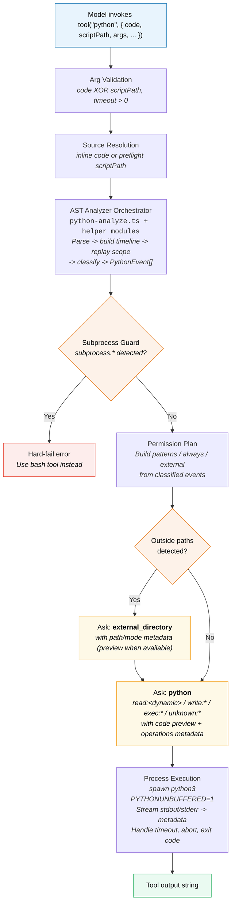

# opencode-python-tool

Custom [OpenCode](https://opencode.ai) `python` tool with static AST-based
classification, permission-aware execution, and defensive runtime behavior for
headless/non-interactive agent workflows.

## Overview

This repository provides a drop-in custom `python` tool for OpenCode. It is
designed for cases where Python execution is the primary action and you want
stronger permission controls than ad-hoc shell execution.

Use this project when you need:

- **Pre-execution static analysis** of Python source via Tree-sitter AST
  parsing, classifying every call into `read`, `write`, `emit`, `exec`,
  `pure`, or `unknown` events.
- **Permission asks when needed** (`python` and/or `external_directory`) before
  execution, with structured metadata including event patterns,
  always-allow suggestions, non-blocking `emit`/`pure` observability, and
  bounded source preview when that source is already available.
- **Guardrails for high-risk execution paths** -- subprocess invocations are
  hard-blocked, dangerous builtins and deserialization calls are denied by
  default.
- **SDK-aware classification** for OCI, GitHub API (ghapi), and
  Atlassian (atlassian-python-api) client libraries.
- **Repeatable tests** around analyzer, runtime, and session-review workflows.

## Documentation Map

- `README.md` for installation, runtime behavior, permissions, and maintenance workflow
- `docs/python-classification-system-design.md` for classifier architecture, provenance model, and extension strategy
- `docs/python-classification-reference.md` for detailed taxonomy tables, SDK coverage, fallback behavior, and name-resolution scope
- `docs/python-classification-system-architecture.mmd` for the top-level classifier architecture diagram source
- `docs/python-classification-provenance-internals.mmd` for the provenance-tracking internals diagram source

## Architecture



## Repository File Map

### Canonical source (`src/`)

| File | Purpose |
|------|---------|
| `src/python.ts` | Runtime entry point: arg validation, source loading, analyzer call, permission asks, subprocess guard, process execution, timeout/abort handling, metadata streaming. |
| `src/python/python-analyze.ts` | Thin public analyzer orchestrator: parse, helper-seed prepass, main replay/classify loop, and `analyzeDetailed()` / `analyze()` exports. |
| `src/python/python-replay.ts` | Replay seam for import/definition/rebind/assignment handlers, helper-seed discovery, and mutation invalidation shared by both replay passes. |
| `src/python/python-analyze-types.ts` | Shared analyzer contracts for `PythonEvent`, `Scope`, `TimelineEntry`, `Rules`, and supporting internal types. |
| `src/python/python-known-methods.ts` | Static analyzer data tables: pure-method inventories, builtin/HTTP constants, effect-kind mapping, and rules-file constants. |
| `src/python/python-bootstrap.ts` | Rules/frontend bootstrap seam: JSON validation, rules loading, `OPENCODE_PYTHON_RULES` handling, and parser caching. |
| `src/python/python-events.ts` | Outward event helpers: `ResolvedEffect` construction, public-event folding, dedupe, and `PythonAnalyzeResult` assembly. |
| `src/python/python-scope.ts` | Lexical scope helpers: bindings/import normalization, invalidation, callable-factory lookup, and tracked-instance/path/container maps. |
| `src/python/python-timeline.ts` | Timeline builder: assignment/rebind/definition/import/call/raise collection plus comprehension-aware ordering rules. |
| `src/python/python-inference.ts` | Public inference barrel that re-exports the focused value/effect/path/container helper modules. |
| `src/python/python-inference-values.ts` | Literal/argument parsing helpers used across classifier, replay, and inference paths. |
| `src/python/python-inference-effects.ts` | Builtin-purity, response-json, dictionary-splat, and pure-container-method helpers that resolve to internal effects. |
| `src/python/python-inference-paths.ts` | Tracked path and iterated-path inference, including rebind path propagation for loop and destructuring targets. |
| `src/python/python-inference-containers.ts` | Container-kind, receiver-kind, iterable-kind, and rebind-container inference for bounded provenance-aware families. |
| `src/python/python-classifier.ts` | Call/raise classifier seam: builtin/guarded/HTTP/Path/GHAPI/Atlassian/subprocess/fallback resolution to internal effects. |
| `src/python/frontend/interface.ts` | Minimal parser frontend contract consumed by the analyzer core. |
| `src/python/frontend/tree-sitter.ts` | Default tree-sitter-backed frontend implementation, including parser/WASM loading and caching. |
| `src/python/python-rule-schema.ts` | Guarded-rule schema parsing and validation for declarative rule extensions that now back the default analyzer path for migrated families. |
| `src/python/python-guard-eval.ts` | Pure guard evaluator used by the analyzer for migrated guarded-rule families. |
| `src/python/python-ir.ts` | Internal analyzer IR and analyzer-version metadata helpers used by runtime metadata. |
| `src/python/python-provenance.ts` | Bounded provenance-graph helpers for receiver/self path tracking, dependency invalidation, and assignment seeding in the main analyzer path. |
| `src/python/python-values.ts` | Shared analyzer value and argument types extracted from the main analyzer implementation. |
| `src/python/python-rules.json` | Declarative call/method/path rule inventory consumed by the analyzer. `candidates.unknown` is review-only evidence, not live classification. |
| `src/python/python.txt` | Tool prompt that guides model usage (`code` vs `scriptPath`, non-interactive constraints, safety behavior). |
| `src/python/env.d.ts` | `*.txt` module typing for TypeScript imports. |
| `src/python-session-report.ts` | Saved-session utility that re-analyzes inline Python snippets from the OpenCode SQLite database, powers review/TUI workflows, previews rule suggestions, compares alternate rule files, and can update `candidates.unknown` in the rules file. |

### OpenCode entrypoints (`.opencode/tool/`)

Thin re-export wrappers so OpenCode discovers the tool:

| File | Re-exports |
|------|------------|
| `.opencode/tool/python.ts` | `export { default } from "../../src/python"` |
| `.opencode/tool/python-analyze.ts` | `export * from "../../src/python/python-analyze"` |

### Configuration and tests (`.opencode/`)

| File | Purpose |
|------|---------|
| `.opencode/opencode.jsonc` | Restrictive default permission policy. |
| `.opencode/package.json` | Dependencies: `@opencode-ai/plugin`, `tree-sitter-python`, `web-tree-sitter`. |
| `.opencode/test/python-analyze-parity.test.ts` | Analyzer parity/evidence tests and fixture-preservation regressions. |
| `.opencode/test/python-analyze-rules-loading.test.ts` | Analyzer rules-loader env/temp-file tests. |
| `.opencode/test/python-analyze-paths-io.test.ts` | Path/IO analyzer tests. |
| `.opencode/test/python-analyze-pure-core.test.ts` | Core pure/emit analyzer tests. |
| `.opencode/test/python-analyze-library-pure.test.ts` | Library-focused pure analyzer tests. |
| `.opencode/test/python-analyze-exec-network.test.ts` | Exec/network/db/tempfile/deserialization analyzer tests. |
| `.opencode/test/python-analyze-integrations.test.ts` | SDK/integration analyzer tests. |
| `.opencode/test/python-analyze-fallbacks.test.ts` | Fallback/context analyzer tests. |
| `.opencode/test/python-validation.test.ts` | Runtime guard tests (arg validation, subprocess hard-fail, ENOENT handling). |
| `.opencode/test/python-runtime-execution.test.ts` | Runtime execution tests (workdir semantics, timeout, abort, streaming). |
| `.opencode/test/python-external-directory.test.ts` | Boundary/runtime tests (scriptPath, external-directory, symlink fallback, always patterns). |
| `.opencode/test/python-inline-permissions-basic.test.ts` | Basic inline permission tests (preview metadata, simple asks, pure/emit behavior, parity smoke). |
| `.opencode/test/python-inline-permissions-inference.test.ts` | Inference-heavy inline permission tests (Path/string/container/HTTP classification). |
| `.opencode/test/python-session-report.test.ts` | Saved-session report regression tests (scan, filtering, malformed-row handling, candidate updates). |
| `.opencode/test/fixtures/context.ts` | Mock `ToolContext` fixture for tests. |
| `.opencode/test/fixtures/python-runtime.ts` | Shared runtime test helpers/constants for the split runtime suites. |

The analyzer split did not add a shared analyzer-specific fixture; helper logic stays local to the focused `python-analyze-*.test.ts` files.

## Requirements

| Requirement | Details |
|-------------|---------|
| **OpenCode** | Custom tools enabled in your target project. |
| **Bun** | Required to install deps and run tests. |
| **Python 3** | Available at runtime as `python3`, or set `OPENCODE_PYTHON_BIN`. |
| **Node-compatible runtime** | For OpenCode plugin execution. |

## Setup (This Repository)

Install dependencies:

```bash
cd .opencode
bun install
```

Quick load check:

```bash
cd .opencode
bun -e "import('./tool/python.ts').then(() => console.log('module loads ok'))"
```

## Installation Into Another Project

### Option 1: Tool-only install (minimal)

The runtime wrappers in `.opencode/tool/` import canonical sources from `src/`,
so both paths must exist in the destination.

```bash
SRC="/path/to/opencode-python-tool"
DST="/path/to/target-repo"

mkdir -p "$DST/.opencode/tool" "$DST/src/python" "$DST/src/python/frontend"

cp "$SRC/src/python.ts" "$DST/src/python.ts"
cp "$SRC/src/python/python-analyze.ts" "$DST/src/python/python-analyze.ts"
cp "$SRC/src/python/python-replay.ts" "$DST/src/python/python-replay.ts"
cp "$SRC/src/python/python-analyze-types.ts" "$DST/src/python/python-analyze-types.ts"
cp "$SRC/src/python/python-known-methods.ts" "$DST/src/python/python-known-methods.ts"
cp "$SRC/src/python/python-bootstrap.ts" "$DST/src/python/python-bootstrap.ts"
cp "$SRC/src/python/python-events.ts" "$DST/src/python/python-events.ts"
cp "$SRC/src/python/python-scope.ts" "$DST/src/python/python-scope.ts"
cp "$SRC/src/python/python-timeline.ts" "$DST/src/python/python-timeline.ts"
cp "$SRC/src/python/python-inference.ts" "$DST/src/python/python-inference.ts"
cp "$SRC/src/python/python-inference-values.ts" "$DST/src/python/python-inference-values.ts"
cp "$SRC/src/python/python-inference-effects.ts" "$DST/src/python/python-inference-effects.ts"
cp "$SRC/src/python/python-inference-paths.ts" "$DST/src/python/python-inference-paths.ts"
cp "$SRC/src/python/python-inference-containers.ts" "$DST/src/python/python-inference-containers.ts"
cp "$SRC/src/python/python-classifier.ts" "$DST/src/python/python-classifier.ts"
cp "$SRC/src/python/python-ir.ts" "$DST/src/python/python-ir.ts"
cp "$SRC/src/python/python-values.ts" "$DST/src/python/python-values.ts"
cp "$SRC/src/python/python-provenance.ts" "$DST/src/python/python-provenance.ts"
cp "$SRC/src/python/python-rule-schema.ts" "$DST/src/python/python-rule-schema.ts"
cp "$SRC/src/python/python-guard-eval.ts" "$DST/src/python/python-guard-eval.ts"
cp "$SRC/src/python/frontend/interface.ts" "$DST/src/python/frontend/interface.ts"
cp "$SRC/src/python/frontend/tree-sitter.ts" "$DST/src/python/frontend/tree-sitter.ts"
cp "$SRC/src/python/python-rules.json" "$DST/src/python/python-rules.json"
cp "$SRC/src/python/python.txt" "$DST/src/python/python.txt"
cp "$SRC/src/python/env.d.ts" "$DST/src/python/env.d.ts"

cp "$SRC/.opencode/tool/python.ts" "$DST/.opencode/tool/python.ts"
cp "$SRC/.opencode/tool/python-analyze.ts" "$DST/.opencode/tool/python-analyze.ts"
```

In `$DST/.opencode/package.json`, ensure these dependencies exist:

```json
{
  "dependencies": {
    "@opencode-ai/plugin": "1.2.15",
    "tree-sitter-python": "0.25.0",
    "web-tree-sitter": "0.25.10"
  }
}
```

Install dependencies and smoke-check module loading:

```bash
cd "$DST/.opencode"
bun install
bun -e "import('./tool/python.ts').then(() => console.log('module loads ok'))"
```

Notes:

- Merge dependency entries into your existing `.opencode/package.json`; do not
  overwrite unrelated tool dependencies.
- Do not copy `.opencode/tool/python.txt` from this repo; prompt text lives
  in `src/python/python.txt`.
- Ensure your target config also includes the recommended `permission.python`
  and `external_directory` rules from this README.

### Option 2: Install with tests (recommended for maintainers)

In addition to Option 1, copy test files and run validation:

```bash
mkdir -p "$DST/.opencode/test/fixtures"
cp "$SRC"/.opencode/test/python-analyze-*.test.ts "$DST/.opencode/test/"
cp "$SRC/.opencode/test/python-validation.test.ts" "$DST/.opencode/test/python-validation.test.ts"
cp "$SRC/.opencode/test/python-runtime-execution.test.ts" "$DST/.opencode/test/python-runtime-execution.test.ts"
cp "$SRC/.opencode/test/python-external-directory.test.ts" "$DST/.opencode/test/python-external-directory.test.ts"
cp "$SRC/.opencode/test/python-inline-permissions-basic.test.ts" "$DST/.opencode/test/python-inline-permissions-basic.test.ts"
cp "$SRC/.opencode/test/python-inline-permissions-inference.test.ts" "$DST/.opencode/test/python-inline-permissions-inference.test.ts"
cp "$SRC/.opencode/test/python-session-report.test.ts" "$DST/.opencode/test/python-session-report.test.ts"
cp "$SRC/.opencode/test/fixtures/context.ts" "$DST/.opencode/test/fixtures/context.ts"
cp "$SRC/.opencode/test/fixtures/python-runtime.ts" "$DST/.opencode/test/fixtures/python-runtime.ts"

cd "$DST/.opencode"
bun test test/python-analyze-*.test.ts
bun test \
  test/python-validation.test.ts \
  test/python-runtime-execution.test.ts \
  test/python-external-directory.test.ts \
  test/python-inline-permissions-basic.test.ts \
  test/python-inline-permissions-inference.test.ts
bun test
```

### Option 3: Global OpenCode install (`~/.config/opencode`)

Use this when your custom tools live in the global OpenCode config instead of a
project-local `.opencode/` folder.

```bash
SRC="/path/to/opencode-python-tool"
OPENCODE_HOME="${OPENCODE_HOME:-$HOME/.config/opencode}"

mkdir -p "$OPENCODE_HOME/tools/python" "$OPENCODE_HOME/tools/python/frontend"

cp "$SRC/src/python.ts" "$OPENCODE_HOME/tools/python.ts"
cp "$SRC/src/python/python-analyze.ts" "$OPENCODE_HOME/tools/python/python-analyze.ts"
cp "$SRC/src/python/python-replay.ts" "$OPENCODE_HOME/tools/python/python-replay.ts"
cp "$SRC/src/python/python-analyze-types.ts" "$OPENCODE_HOME/tools/python/python-analyze-types.ts"
cp "$SRC/src/python/python-known-methods.ts" "$OPENCODE_HOME/tools/python/python-known-methods.ts"
cp "$SRC/src/python/python-bootstrap.ts" "$OPENCODE_HOME/tools/python/python-bootstrap.ts"
cp "$SRC/src/python/python-events.ts" "$OPENCODE_HOME/tools/python/python-events.ts"
cp "$SRC/src/python/python-scope.ts" "$OPENCODE_HOME/tools/python/python-scope.ts"
cp "$SRC/src/python/python-timeline.ts" "$OPENCODE_HOME/tools/python/python-timeline.ts"
cp "$SRC/src/python/python-inference.ts" "$OPENCODE_HOME/tools/python/python-inference.ts"
cp "$SRC/src/python/python-inference-values.ts" "$OPENCODE_HOME/tools/python/python-inference-values.ts"
cp "$SRC/src/python/python-inference-effects.ts" "$OPENCODE_HOME/tools/python/python-inference-effects.ts"
cp "$SRC/src/python/python-inference-paths.ts" "$OPENCODE_HOME/tools/python/python-inference-paths.ts"
cp "$SRC/src/python/python-inference-containers.ts" "$OPENCODE_HOME/tools/python/python-inference-containers.ts"
cp "$SRC/src/python/python-classifier.ts" "$OPENCODE_HOME/tools/python/python-classifier.ts"
cp "$SRC/src/python/python-ir.ts" "$OPENCODE_HOME/tools/python/python-ir.ts"
cp "$SRC/src/python/python-values.ts" "$OPENCODE_HOME/tools/python/python-values.ts"
cp "$SRC/src/python/python-provenance.ts" "$OPENCODE_HOME/tools/python/python-provenance.ts"
cp "$SRC/src/python/python-rule-schema.ts" "$OPENCODE_HOME/tools/python/python-rule-schema.ts"
cp "$SRC/src/python/python-guard-eval.ts" "$OPENCODE_HOME/tools/python/python-guard-eval.ts"
cp "$SRC/src/python/frontend/interface.ts" "$OPENCODE_HOME/tools/python/frontend/interface.ts"
cp "$SRC/src/python/frontend/tree-sitter.ts" "$OPENCODE_HOME/tools/python/frontend/tree-sitter.ts"
cp "$SRC/src/python/python-rules.json" "$OPENCODE_HOME/tools/python/python-rules.json"
cp "$SRC/src/python/python.txt" "$OPENCODE_HOME/tools/python/python.txt"
cp "$SRC/src/python/env.d.ts" "$OPENCODE_HOME/tools/python/env.d.ts"
```

`src/python.ts` now resolves the package import for global installs and falls
back to the project-local `.opencode` plugin path when needed, so no manual
import rewrite is required after copying. Then install dependencies and
smoke-check:

```bash
cd "$OPENCODE_HOME"
bun install
bun -e "import('./tools/python.ts').then(() => console.log('python tool loads ok'))"
```

## Recommended Permission Configuration

Add these rules under `permission` in your OpenCode config (`opencode.jsonc`):

```jsonc
{
  "permission": {
    "python": {
      "*": "ask",
      "exec:eval": "deny",
      "exec:exec": "deny",
      "exec:compile": "deny",
      "exec:subprocess": "deny",
      "exec:__import__": "deny",
      "exec:os.system": "deny",
      "exec:os.popen": "deny",
      "exec:os.exec*": "deny",
      "exec:pickle.load": "deny",
      "exec:pickle.loads": "deny",
      "exec:marshal.load": "deny",
      "exec:marshal.loads": "deny",
      "unknown:*": "ask"
    },
    "external_directory": "ask"
  }
}
```

> **Note:** This matches the shipped `.opencode/opencode.jsonc` exactly. The
> `exec:subprocess` deny is a defense-in-depth complement to the runtime
> subprocess hard-fail guard.

Operational guidance:

| Rule | Rationale |
|------|-----------|
| `python:*` = `ask` | Forces explicit human review for emitted `python` permission patterns (`read:<dynamic>`, `write:*`, `exec:*`, `unknown:*`). Literal reads that stay inside the worktree are auto-allowed because no `python` read pattern is emitted. |
| `exec:eval`, `exec:exec`, `exec:compile`, `exec:__import__` = `deny` | Blocks dynamic code execution that bypasses static analysis. |
| `exec:subprocess` = `deny` | Defense-in-depth alongside the runtime subprocess guard. |
| `exec:os.system`, `exec:os.popen`, `exec:os.exec*` = `deny` | Blocks shell/process spawning that should use the `bash` tool. |
| `exec:pickle.*`, `exec:marshal.*` = `deny` | Blocks dangerous deserialization (arbitrary code execution risk). |
| `unknown:*` = `ask` | Prevents auto-approving unanalyzed or unrecognized behavior. |
| `external_directory` = `ask` | Prevents silent cross-worktree file access. |

## OpenCode Fork: Enhanced TUI Permission Rendering

This tool works fully with **stock/upstream OpenCode** — no fork is required for
core functionality. Arg validation, AST analysis, permission asks, subprocess
guarding, and process execution all operate correctly on any OpenCode
installation that supports custom tools.

A companion fork of OpenCode adds **Python-specific TUI enhancements** to the
permission prompt rendering. These changes improve the operator experience when
reviewing `python` and `external_directory` permission asks but do not affect
runtime behavior or security posture.

### Comparison: Stock vs Forked OpenCode

| Capability | Stock OpenCode | Forked OpenCode |
|------------|----------------|-----------------|
| **Permission prompt rendering** | Generic/fallback prompt — shows permission patterns (`read:*`, `exec:*`, etc.) and Allow/Reject actions. No Python-specific context. | Python-specific compact summary showing description, mode (`inline`/`script`), script path, args, workdir, bounded provenance rows, and code preview with line/byte counts. |
| **Code preview in prompt body** | Not rendered. Metadata is sent by the tool but the stock TUI does not display it. | Compact code preview displayed inline after bounded provenance rows, with truncation status. |
| **`ctrl+f` fullscreen view** | Generic permission info. | Full Python source code with bounded provenance rows above it, using precedence: `codeExpanded` (<= 50 KB) -> inline `code` -> `codePreview` fallback. |
| **`external_directory` context** | Generic directory information. | Python-aware context showing approved patterns plus source preview/provenance after source is loaded; preflight outside-script approval may omit those fields. |
| **Config schema for `python` key** | Works at runtime via `.catchall()` but `python` does not appear in config schema autocompletion. | `python` registered as a named permission key — editors provide autocompletion for `permission.python.*` rules. |

### Fork status

- The fork lives at `./opencode` in this repository (gitignored; not shipped).
- Implementation commits: `bdc1d13` (renderer + helper), `9f1bb60` (config
  schema registration).
- Focused tests pass: 69 pass, 0 fail (permission-python + config suites).
- Full fork test suite: 1180 pass, 5 skip, 0 fail.
- Phase 4 (isolated tmux E2E validation) and Phase 5 (PR packaging) are still
  TODO before upstream submission.
- PR plan: `docs/opencode-tui-python-permission-pr-plan.md`.

### Using the fork

**Option A — Local launcher:** Build the fork source and set up an
`opencode-fork` alias/script that runs from `./opencode`. This gives the
enhanced TUI immediately.

**Option B — Wait for upstream merge:** Continue using stock OpenCode. Once the
fork changes are accepted upstream, the enhanced rendering becomes available
automatically on upgrade. No changes to this tool or its configuration are
needed either way.

## Security Rationale

The default deny statements block high-risk execution paths that are difficult
to review safely in an automated flow.

### Why these denies matter

| Category | Calls | Risk |
|----------|-------|------|
| **Dynamic execution** | `eval`, `exec`, `compile`, `__import__` | Arbitrary code execution or dynamic module loading bypasses static intent review. |
| **Process spawning** | `subprocess.*`, `os.system`, `os.popen`, `os.exec*` | Spawns or replaces processes, executes shell commands, bypasses non-terminal safety boundary. |
| **Unsafe deserialization** | `pickle.load/loads`, `marshal.load/loads` | Deserializes untrusted data into executable behavior (known arbitrary code execution vector). |

### Concrete risk examples (if denies are removed)

- A seemingly harmless script can pull a payload string from disk/network and
  run it via `exec`, bypassing static call-level intent checks.
- Shell-capable calls can chain from Python into broader system operations that
  should instead be reviewed through the `bash` tool boundary.
- Unsafe deserialization can execute attacker-controlled object constructors at
  load time.

### Least-privilege recommendations

1. Start from deny + ask defaults and only relax one pattern at a time.
2. Scope approvals narrowly (specific calls/paths); avoid global wildcards.
3. Require explicit human review for new `exec:*` patterns.
4. Periodically re-audit policy exceptions after incident/near-miss events.

## Analyzer Classification Reference

Detailed classifier documentation now lives in:

- `docs/python-classification-system-design.md` for architecture, provenance, and extension strategy
- `docs/python-classification-reference.md` for taxonomy, classification tables, fallback behavior, and name-resolution scope
- `docs/python-classification-system-architecture.mmd` and `docs/python-classification-provenance-internals.mmd` for standalone Mermaid sources

## Runtime Behavior

### Source modes

| Mode | Execution | When |
|------|-----------|------|
| `code` | `python -c <source>` | Inline Python snippets |
| `scriptPath` | `python <path>` | Existing script files |

Exactly one of `code` or `scriptPath` must be provided.

### Tool arguments

| Argument | Type | Required | Default | Description |
|----------|------|----------|---------|-------------|
| `code` | `string` | One of | -- | Inline Python source code |
| `scriptPath` | `string` | these | -- | Path to a Python script file |
| `args` | `string[]` | No | `[]` | Arguments passed to the Python program |
| `workdir` | `string` | No | Project directory | Working directory for execution |
| `timeout` | `number` | No | `120000` (2 min) | Timeout in milliseconds |
| `description` | `string` | Yes | -- | Human-readable description for approval prompts |

### Python interpreter resolution

The runtime resolves a Python interpreter in this order:

1. `OPENCODE_PYTHON_BIN` environment variable (if set).
2. `$VIRTUAL_ENV/bin/python3` (if `VIRTUAL_ENV` is set and binary exists).
3. `<worktree>/.venv/bin/python3` (if exists).
4. `<worktree>/venv/bin/python3` (if exists).
5. System `python3`.

### Permission asks and code preview metadata

Before execution, the runtime analyzes source and asks permissions with metadata:

- Asks `external_directory` when `workdir`, `scriptPath`, or literal file paths
  resolve outside the worktree. Outside-worktree `scriptPath` approval happens
  before the script file is loaded.
- Auto-allows literal filesystem reads that resolve inside the worktree.
- Asks `python` with event-derived patterns for dynamic reads plus
  `write:*`, `exec:*`, and `unknown:*` operations.
- Keeps `emit`/`pure` in runtime `operations` metadata for observability, but does
  not ask `python` permissions for those kinds by default.
- Adds optional operation metadata such as `canonicalSource`, `receiverKind`,
  `ruleHit`, `guardFailure`, and dependency signatures when the analyzer has
  bounded evidence for them.
- Fork-aware TUI builds render bounded `metadata.operations` rows ahead of the
  source preview in bracketed `[kind] [source] [provenance]` form, with the
  third bracket omitted when it would add only low-signal repetition.
- Includes bounded executable-source preview in `python` ask metadata and in
  Python-originated `external_directory` asks once source is loaded; preflight
  outside-worktree `scriptPath` approval may not include source preview or
  provenance.

#### Preview limits

| Limit | Value |
|-------|-------|
| Max preview bytes | `4,000` |
| Max preview lines | `120` |
| Truncation marker | `...<python_permission_preview_truncated>` |
| Max expanded bytes | `50,000` (only when preview is truncated) |
| Max metadata output | `30,000` characters |
| Max analysis input | `100 KB` (larger sources skip analysis) |

When source exceeds the preview limit, the ask metadata includes:
- `codePreview`: truncated preview text
- `codePreviewTruncated`: `true`
- `codeExpanded`: full source (only if <= 50 KB)
- `codeExpandedAvailable`: `boolean` indicating whether expanded source was included

### Subprocess hard-fail behavior

Direct `subprocess.*` invocation is rejected **before** any permission ask. The
runtime returns an error redirecting terminal/process orchestration to the `bash`
tool.

This keeps the `python` tool focused on Python execution and avoids blending it
with shell orchestration behavior.

### Process execution environment

The spawned Python process runs with:

| Setting | Value | Purpose |
|---------|-------|---------|
| `PYTHONDONTWRITEBYTECODE` | `1` | Prevents `.pyc` file creation |
| `PYTHONUNBUFFERED` | `1` | Ensures real-time stdout/stderr streaming |
| `stdio` | `['ignore', 'pipe', 'pipe']` | stdin closed; stdout/stderr captured |
| `detached` | `true` (non-Windows) | Enables process group cleanup on kill |

### Kill behavior

On timeout or abort, the runtime sends `SIGTERM` to the process group, then
`SIGKILL` after 1 second if the process hasn't exited.

### Output metadata

Structured metadata is streamed incrementally as output arrives:

```json
{
  "output": "<captured stdout+stderr>",
  "description": "<tool description>",
  "command": "<reconstructed command line>",
  "cwd": "<resolved working directory>",
  "exit": 0
}
```

Output longer than 30,000 characters is truncated in metadata (full output is
still returned as the tool result).

Terminal conditions append `<python_metadata>` to the output:

| Condition | Metadata line |
|-----------|---------------|
| Timeout exceeded | `python tool terminated command after exceeding timeout <ms> ms` |
| User abort | `User aborted the command` |
| Non-zero exit | `Exit code: <code>` |

## Environment Variables

| Variable | Purpose | Default |
|----------|---------|---------|
| `OPENCODE_PYTHON_BIN` | Override Python interpreter path | `python3` (after venv resolution) |
| `OPENCODE_PYTHON_RULES` | Override analyzer rules JSON path | bundled `src/python/python-rules.json` |
| `VIRTUAL_ENV` | Standard venv activation indicator; used for interpreter resolution | -- |

## JSON Rules and Session Report

- The analyzer loads declarative rule data from `src/python/python-rules.json` by default. Set `OPENCODE_PYTHON_RULES` to point at a different rules file.
- `src/python-session-report.ts` scans saved OpenCode sessions, re-analyzes inline `state.input.code`, skips `scriptPath` entries, and suppresses calls back into definitions declared in the same snippet.
- `--update-candidates` only updates `candidates.unknown` in the rules JSON. It does not automatically change live `methods`, `calls`, or `pathCalls` classifier buckets.
- `--review-next` and `--decide` provide a snippet-centric human review loop backed by a sidecar ledger, with decisions such as `read`, `write`, `emit`, `exec`, `pure`, `ignore`, and `needs-code`.
- `--review-families` and `--review-families-json` provide read-only family/module summaries on top of the pending review queue so you can pick a whole family to investigate before dropping into snippet-by-snippet review.
- The review ledger stores the exact occurrence fingerprint plus review identity metadata (`kind` and `sourceCall` when available). Exact fingerprint matches always replay, while cross-snippet reuse only happens when the later occurrence resolves to the same review identity.
- `--review-tui` provides a one-key terminal review UI that opens with the full syntax-highlighted code page visible and one focused candidate at a time; the active call is visually emphasized, `v` toggles between full-page and focused-window code views, and a transient status line is shown while loading/rescoring the next candidate. Default `y` suggestions are `read`, `write`, `emit`, `ignore`, or `pure` (not `needs-code`), while `c` remains an explicit `needs-code` override.
- Review modes include `unknown` by default; add `--include-emit` to audit already-classified `emit` callables and `--include-pure` when you also want `pure` candidates in the queue. Promoted callables should no longer reappear in default review runs.
- `--review-next` now asks `opencode run` for taxonomy confidence scores (`read`, `write`, `emit`, `exec`, `pure`, `unknown`), caches successful score bundles, and falls back to local heuristics if scoring fails.
- `--promote-reviewed` promotes consistently reviewed outward call strings into `calls.read`, `calls.write`, `calls.emit`, or `calls.exec`, but blocks promotion when one live call target would merge multiple reviewed identities.
- Recommended operator flow is: `--update-candidates` -> `--review-families`/`--review-families-json` -> optional `--family`/`--module` pivot into `--review-next` -> broader `--review-tui` or more `--review-next` decisions as needed -> `--suggest-rules`/`--compare-rules` -> `--promote-reviewed` -> rerun the report.
- `src/python-session-report.ts` is an operator utility run from this repo checkout; it is not an OpenCode tool that belongs in `~/.config/opencode/tools/`.

Example report commands:

```bash
cd .opencode
bundle="${XDG_DATA_HOME:-$HOME/.local/share}/opencode/opencode.db"
ledger="${XDG_STATE_HOME:-$HOME/.local/state}/opencode/python-session-review.json"
scores="${XDG_STATE_HOME:-$HOME/.local/state}/opencode/python-session-score-cache.json"

bun run ../src/python-session-report.ts --db "$bundle"
bun run ../src/python-session-report.ts --db "$bundle" --since 2026-03-01T00:00:00Z --samples 5
bun run ../src/python-session-report.ts --db "$bundle" --json
bun run ../src/python-session-report.ts --db "$bundle" --update-candidates
bun run ../src/python-session-report.ts --db "$bundle" --ledger "$ledger" --suggest-rules
bun run ../src/python-session-report.ts --db "$bundle" --ledger "$ledger" --compare-rules ../tmp/python-rules-alt.json
bun run ../src/python-session-report.ts --db "$bundle" --ledger "$ledger" --review-families
bun run ../src/python-session-report.ts --db "$bundle" --ledger "$ledger" --review-families-json
bun run ../src/python-session-report.ts --db "$bundle" --ledger "$ledger" --review-families --family re.Match.group
bun run ../src/python-session-report.ts --db "$bundle" --ledger "$ledger" --score-cache "$scores" --review-next
bun run ../src/python-session-report.ts --db "$bundle" --ledger "$ledger" --score-cache "$scores" --review-next --module pytest
bun run ../src/python-session-report.ts --db "$bundle" --ledger "$ledger" --score-cache "$scores" --review-tui
bun run ../src/python-session-report.ts --db "$bundle" --ledger "$ledger" --review-next --decide 1=read,2=emit
bun run ../src/python-session-report.ts --db "$bundle" --ledger "$ledger" --review-next --include-emit
bun run ../src/python-session-report.ts --db "$bundle" --ledger "$ledger" --review-next --include-pure
bun run ../src/python-session-report.ts --db "$bundle" --ledger "$ledger" --rules ../src/python/python-rules.json --promote-reviewed
bun run ../src/python-session-report.ts --db "$bundle" --rules ../src/python/python-rules.json --update-candidates
```

Use a full scan for `--promote-reviewed`; it intentionally rejects `--since` so older unresolved contexts cannot be skipped during promotion.

If you want to invalidate cached `opencode run` scores, remove `${XDG_STATE_HOME:-$HOME/.local/state}/opencode/python-session-score-cache.json`.

## Testing and Verification

Run from `.opencode/`:

```bash
# analyzer-focused tests
bun test test/python-analyze-*.test.ts

# report utility tests
bun test test/python-session-report.test.ts

# runtime-focused tests (trim this list to the split file(s) you touched)
bun test \
  test/python-validation.test.ts \
  test/python-runtime-execution.test.ts \
  test/python-external-directory.test.ts \
  test/python-inline-permissions-basic.test.ts \
  test/python-inline-permissions-inference.test.ts

# full suite
bun test
```

Module load check:

```bash
bun -e "import('./tool/python.ts').then(() => console.log('module loads ok'))"
```

Global install smoke check:

```bash
OPENCODE_HOME="${OPENCODE_HOME:-$HOME/.config/opencode}"
cd "$OPENCODE_HOME"
bun -e "import('./tools/python.ts').then(() => console.log('python tool loads ok'))"
```

Session report smoke check:

```bash
cd .opencode
bun run ../src/python-session-report.ts --help
```

### Test coverage summary

| Suite | Tests | Coverage |
|-------|-------|----------|
| **Analyzer** | 100+ | `open()` modes/paths, Path methods, guarded rules, builtin purity, json/yaml, exec builtins, network/HTTP, database, tempfile, deserialization, OCI constructors/methods/config, ghapi direct/instance/workflow, Atlassian constructors/instances/provenance, evidence plumbing, edge cases, decorators/nested contexts |
| **Runtime** | 90+ | Arg validation (XOR, timeout, empty), subprocess hard-fail, permission patterns (read/write/exec/unknown/callable), script-file permissions, external directory detection, always patterns, ENOENT handling, workdir semantics, process execution, timeout, abort, streaming, metadata capping, enriched operation metadata |

> **Note:** Runtime process-execution tests require `python3` on PATH and are
> automatically skipped if unavailable.

## Known Limitations and Tradeoffs

| Limitation | Details |
|------------|---------|
| **Alias resolution** | Intentionally bounded. The analyzer resolves explicit import aliases, simple same-scope local rebindings, and invalidation for common rebinding sites (`for`, `with ... as`, `except ... as`), but wrapper/interprocedural summaries still remain intentionally narrow. |
| **Large script fallback** | Sources > 100 KB skip AST analysis entirely and produce `unknown:large-script`. |
| **Static analysis depth** | Call-pattern based, not a full data-flow sandbox. The analyzer now handles bounded lexical alias resolution, but deeper wrapper inference, cross-function propagation, and dynamic Python features remain out of scope. |
| **Metadata preview truncation** | Permission ask preview is intentionally truncated (4 KB / 120 lines). Expanded source capped at 50 KB. Very large scripts have no source in ask payload. |
| **Atlassian bare constructor ambiguity** | Bare `Jira()`, `Confluence()`, etc. are only classified as Atlassian constructors when `from atlassian import ...` provenance is detected in the source. Without the import, they fall back to `unknown:callable:Jira`. |
| **Instance tracking is position-dependent** | ghapi and Atlassian instance tracking is based on source order. Calls before the assignment are not tracked, and rebinding remains a conservative delete-only boundary rather than a control-flow-sensitive lifetime model. |

## Update / Upgrade Workflow

When this repo changes, use one of these refresh paths.

### Project-local refresh (`<repo>/.opencode` + `src/`)

1. Pull latest changes in this repository.
2. Re-copy core files:
   - `src/python.ts`
   - `src/python/python-analyze.ts`
   - `src/python/python-replay.ts`
   - `src/python/python-analyze-types.ts`
   - `src/python/python-known-methods.ts`
   - `src/python/python-bootstrap.ts`
   - `src/python/python-events.ts`
   - `src/python/python-scope.ts`
   - `src/python/python-timeline.ts`
   - `src/python/python-inference.ts`
   - `src/python/python-inference-values.ts`
   - `src/python/python-inference-effects.ts`
   - `src/python/python-inference-paths.ts`
   - `src/python/python-inference-containers.ts`
   - `src/python/python-classifier.ts`
   - `src/python/python-ir.ts`
   - `src/python/python-values.ts`
   - `src/python/python-provenance.ts`
   - `src/python/python-rule-schema.ts`
   - `src/python/python-guard-eval.ts`
   - `src/python/frontend/interface.ts`
   - `src/python/frontend/tree-sitter.ts`
   - `src/python/python-rules.json`
   - `src/python/python.txt`
   - `src/python/env.d.ts`
   - `.opencode/tool/python.ts`
   - `.opencode/tool/python-analyze.ts`
3. Reconcile destination `.opencode/package.json` dependency versions.
4. Run `bun install` in destination `.opencode/`.
5. (If tests are installed) run `bun test` in destination `.opencode/`.
6. Re-validate permission policy contains recommended denies + asks.
7. If you use candidate updates downstream, reconcile `src/python/python-rules.json` before overwriting local edits.

### Global refresh (`~/.config/opencode/tools`)

1. Pull latest changes in this repository.
2. Re-copy core files:
   - `src/python.ts` -> `tools/python.ts`
   - `src/python/python-analyze.ts` -> `tools/python/python-analyze.ts`
   - `src/python/python-replay.ts` -> `tools/python/python-replay.ts`
   - `src/python/python-analyze-types.ts` -> `tools/python/python-analyze-types.ts`
   - `src/python/python-known-methods.ts` -> `tools/python/python-known-methods.ts`
   - `src/python/python-bootstrap.ts` -> `tools/python/python-bootstrap.ts`
   - `src/python/python-events.ts` -> `tools/python/python-events.ts`
   - `src/python/python-scope.ts` -> `tools/python/python-scope.ts`
   - `src/python/python-timeline.ts` -> `tools/python/python-timeline.ts`
   - `src/python/python-inference.ts` -> `tools/python/python-inference.ts`
   - `src/python/python-inference-values.ts` -> `tools/python/python-inference-values.ts`
   - `src/python/python-inference-effects.ts` -> `tools/python/python-inference-effects.ts`
   - `src/python/python-inference-paths.ts` -> `tools/python/python-inference-paths.ts`
   - `src/python/python-inference-containers.ts` -> `tools/python/python-inference-containers.ts`
   - `src/python/python-classifier.ts` -> `tools/python/python-classifier.ts`
   - `src/python/python-ir.ts` -> `tools/python/python-ir.ts`
   - `src/python/python-values.ts` -> `tools/python/python-values.ts`
   - `src/python/python-provenance.ts` -> `tools/python/python-provenance.ts`
   - `src/python/python-rule-schema.ts` -> `tools/python/python-rule-schema.ts`
   - `src/python/python-guard-eval.ts` -> `tools/python/python-guard-eval.ts`
   - `src/python/frontend/interface.ts` -> `tools/python/frontend/interface.ts`
   - `src/python/frontend/tree-sitter.ts` -> `tools/python/frontend/tree-sitter.ts`
   - `src/python/python-rules.json` -> `tools/python/python-rules.json`
   - `src/python/python.txt` -> `tools/python/python.txt`
   - `src/python/env.d.ts` -> `tools/python/env.d.ts`
3. Run `bun install` in `~/.config/opencode`.
4. Run module-load smoke check:
    - `bun -e "import('./tools/python.ts').then(() => console.log('python tool loads ok'))"`
5. If you use the session-report workflow with a global install, run the repo's `src/python-session-report.ts` against `tools/python/python-rules.json` rather than copying the utility into `tools/`.

For low-drift maintenance, keep this repository as the canonical source and
avoid editing copied files independently in downstream projects.

## Development

### Project structure

```
opencode-python-tool/
  src/
    python.ts                    # Runtime entry point
    python-session-report.ts     # Saved-session reporting utility
    python/
      python-analyze.ts          # Thin analyzer orchestrator
      python-replay.ts           # Replay handlers + helper-seed prepass
      python-analyze-types.ts    # Shared analyzer contracts
      python-known-methods.ts    # Static method/HTTP/effect tables
      python-bootstrap.ts        # Rules/frontend loading
      python-events.ts           # Public event/result folding
      python-scope.ts            # Scope + import helpers
      python-timeline.ts         # Timeline collection
      python-inference.ts        # Public inference barrel
      python-inference-values.ts # Literal/arg parsing
      python-inference-effects.ts # Builtin purity + effect helpers
      python-inference-paths.ts  # Path + iterated-path inference
      python-inference-containers.ts # Container + iterable inference
      python-classifier.ts       # Call/raise classification
      python-ir.ts               # Internal IR + analyzer metadata
      python-values.ts           # Shared PythonValue / PythonArgs types
      python-provenance.ts       # Receiver/self provenance helpers
      python-rule-schema.ts      # Guarded rule schema parsing
      python-guard-eval.ts       # Guard predicate evaluation
      python-rules.json          # Declarative classifier rules
      python.txt                 # Tool prompt
      env.d.ts                   # .txt module declaration
  .opencode/
    tool/
      python.ts                  # Re-export wrapper
      python-analyze.ts          # Re-export wrapper
    test/
      python-analyze-parity.test.ts # Analyzer parity/evidence tests
      python-analyze-rules-loading.test.ts # Analyzer rules-loader tests
      python-analyze-paths-io.test.ts # Path/IO analyzer tests
      python-analyze-pure-core.test.ts # Core pure/emit analyzer tests
      python-analyze-library-pure.test.ts # Library-focused pure analyzer tests
      python-analyze-exec-network.test.ts # Exec/network/db/tempfile/deserialization analyzer tests
      python-analyze-integrations.test.ts # SDK/integration analyzer tests
      python-analyze-fallbacks.test.ts # Fallback/context analyzer tests
      python-session-report.test.ts # Report utility tests
      python-validation.test.ts  # Runtime guard tests
      python-runtime-execution.test.ts # Runtime execution/workdir tests
      python-external-directory.test.ts # Runtime boundary/external-directory tests
      python-inline-permissions-basic.test.ts # Basic inline runtime permission tests
      python-inline-permissions-inference.test.ts # Inference-heavy inline runtime permission tests
      fixtures/
        context.ts               # Mock ToolContext
        python-runtime.ts        # Shared runtime test helpers
    opencode.jsonc               # Permission policy
    package.json                 # Dependencies
  docs/                          # Plans, continuity, design docs
  opencode/                      # Reference only (gitignored)
```

### Adding new call classifications

1. Add declarative call, method, or path rules to `src/python/python-rules.json` when the pattern fits the existing rule model.
2. Use `bun run ../src/python-session-report.ts --update-candidates` from `.opencode/` to gather unknown-call evidence into `candidates.unknown`.
3. Use `--review-families` or `--review-families-json` to pick the best family-level target before dropping into snippet review. Treat labels as triage only: `rule` means the family shape is stable, `provenance` means receiver/source evidence matters, `manual-split` means one blanket rule is too broad, and `blocked` means you still need modeling or code inspection before a family-level change.
4. Use selectors when they help: `--module pytest` is a good clean module-backed example, `--family re.Match.group` is a good provenance-backed example, and repeated dotted calls such as `hashlib.sha256` can still stay blocked until the current workflow trusts them enough for module-level action. Selector matching is exact, `--module` only works for trusted module roots, and `--family` / `--module` are mutually exclusive.
5. Use `--review-next` with selectors when you want representative snippets for one family/module, or use broader `--review-tui` review without selectors when you want the full queue. Exact fingerprint matches replay directly, and cross-snippet reuse only happens when `kind` plus canonical callable context match.
6. Use `--suggest-rules` to preview unanimous reviewed clusters as copy-pasteable rule fragments (`calls.*` today, or bounded `guarded.methods` fragments when receiver evidence is sufficient), and `--compare-rules <file>` to diff review outcomes against an alternate rules file before promoting changes.
7. Only after the family looks safe and the representative snippets agree, use `--promote-reviewed` to move single-identity call targets into `calls.read`, `calls.write`, `calls.emit`, or `calls.exec`.
8. Prefer guarded declarative rules before adding new procedural branches. Put classification logic in `src/python/python-classifier.ts`, replay-state transitions in `src/python/python-replay.ts`, inference/path/container logic in `src/python/python-inference.ts` and its focused submodules, and scope/timeline mechanics in `src/python/python-scope.ts` or `src/python/python-timeline.ts`; the guarded schema lives in `src/python/python-rule-schema.ts` and `src/python/python-guard-eval.ts`.
9. Add analyzer cases in the relevant `.opencode/test/python-analyze-*.test.ts` file and update `.opencode/test/python-session-report.test.ts` when review/report behavior changes.
10. If the new pattern should be denied by default, add the corresponding
   `exec:<pattern>` deny rule to both `.opencode/opencode.jsonc` and the
   README's recommended configuration.
11. Run `bun test` from `.opencode/` to validate.

### Adding new SDK coverage

For SDK-specific instance tracking (like ghapi/Atlassian patterns):

1. Define constructor sets and method allowlists in `src/python/python-rules.json` or `src/python/python-known-methods.ts`, depending on whether the surface is declarative or static-data-backed.
2. Add instance tracking or replay seeding in `src/python/python-replay.ts` only when it truly belongs to replay order; otherwise prefer `src/python/python-scope.ts` or `src/python/python-inference.ts`.
3. Resolve call behavior in `src/python/python-classifier.ts`, keeping the orchestrator limited to replay sequencing and event folding.
4. Add comprehensive tests covering: direct calls, instance method calls,
   reassignment invalidation, alias deferral, and provenance requirements.

## License

This project is not yet licensed. Contact the maintainer for usage terms.
