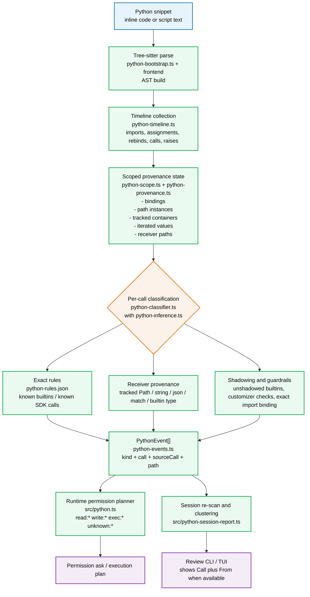
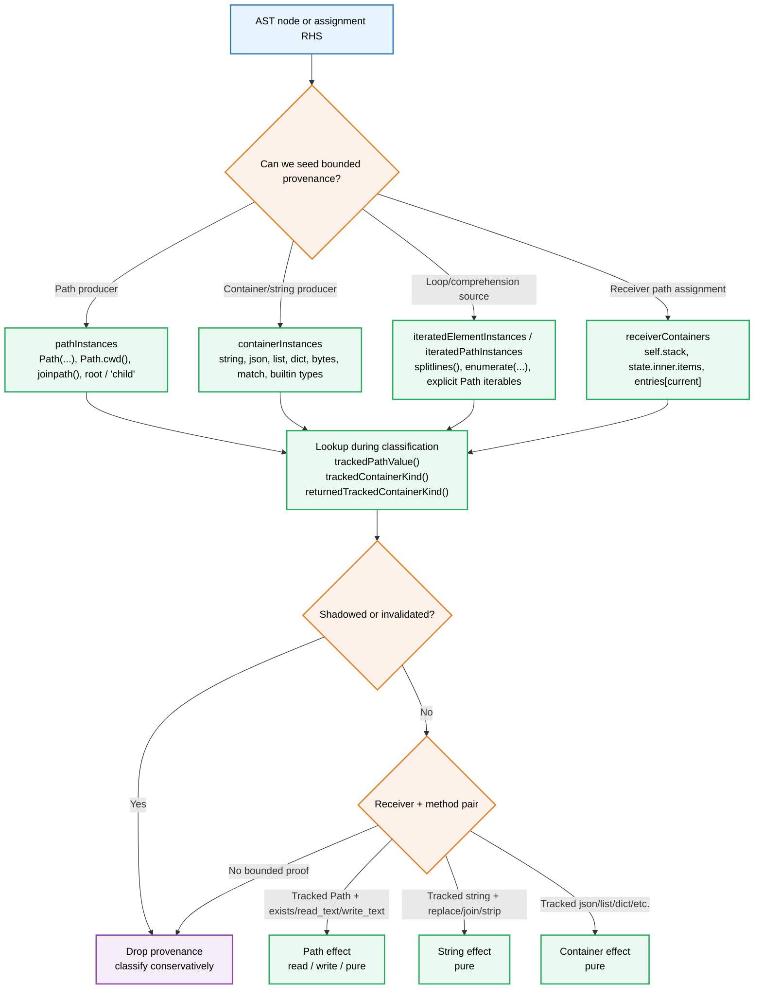

# Python Classification System Design

## Goal

Provide a bounded, provenance-aware classifier for inline Python snippets so the tool can:

- build permission prompts for real external effects
- suppress noise for safe in-memory operations
- surface uncertain behavior as reviewable `unknown` events

This design is implemented as a thin orchestrator in `src/python/python-analyze.ts` plus focused helper seams under `src/python/`, consumed by `src/python.ts`, and audited through `src/python-session-report.ts`.

## Non-Goals

- full Python type inference
- whole-program interprocedural analysis
- speculative purity based only on method names
- broad SDK/object heuristics for arbitrary receivers

## Taxonomy

The analyzer emits `PythonEvent`s with one of six kinds:

- `read`: external ingestion such as file reads, network reads, or state checks like `Path.exists()`
- `write`: external mutation such as file writes or destructive API/database actions
- `emit`: non-blocking reporting such as `print` or logging
- `exec`: dynamic execution, process launch, or high-risk control transfer
- `pure`: bounded in-memory computation with no visible side effects
- `unknown`: anything not proven safe enough to classify

Each event carries a display `call`, optional `sourceCall`, and optional path metadata.

## Design Principles

- Exact over fuzzy: prefer exact call names, exact imports, and exact producer shapes.
- Provenance over suffixes: classify `join`, `replace`, `group`, `exists`, and similar methods from receiver origin, not name alone.
- Bounded expansion: add support only for common, explicit patterns with tests.
- Conservative fallback: unresolved cases stay `unknown`.

## Architecture

See also the standalone diagram in `docs/python-classification-system-architecture.mmd`.

## Processing Pipeline

### Module ownership

- `src/python/python-analyze.ts`: orchestrates parse, helper-seed prepass, main replay/classification dispatch, and final event folding
- `src/python/python-bootstrap.ts`: loads and validates rules plus parser frontend caches
- `src/python/python-replay.ts`: owns stateful replay handlers, helper-seed discovery, and mutation invalidation shared across replay passes
- `src/python/python-timeline.ts`: builds source-ordered timeline entries with comprehension-aware rebinding semantics
- `src/python/python-scope.ts`: manages bindings, invalidation, imports, and tracked instances
- `src/python/python-inference.ts`: public barrel for focused inference submodules
- `src/python/python-inference-values.ts`: parses literals and call arguments
- `src/python/python-inference-effects.ts`: resolves builtin-pure, response-json, and dictionary-splat effect helpers
- `src/python/python-inference-paths.ts`: derives path and iterated-path provenance
- `src/python/python-inference-containers.ts`: derives container, receiver, iterable, and rebind provenance
- `src/python/python-classifier.ts`: resolves calls and raises into internal effects
- `src/python/python-events.ts`: folds internal effects into outward `PythonEvent[]`

### 1. Parse and normalize

The analyzer parses a snippet into an AST and rejects empty or malformed input early.

### 2. Build a timeline

Instead of classifying only from final AST shape, the system builds an execution-like timeline of:

- imports
- assignments
- loop/comprehension rebinds
- calls
- raises
- definitions that shadow names

This lets classification respect evaluation order, including patterns like `text = text.replace(...)`.

### 3. Maintain scoped provenance

As the timeline is replayed, each lexical scope maintains tracked facts such as:

- import aliases and direct bindings
- `pathInstances` for bounded Path values
- `containerInstances` for tracked containers like `string`, `json`, `list`, `dict`
- iterated element/path instances for loops and comprehensions
- shallow receiver-path provenance like `self.stack` or `entries[current]`

This state is invalidated on reassignment so stale provenance does not leak forward.

### 4. Classify each call

For each call node, classification proceeds roughly from safest/most explicit evidence to least:

1. exact builtin and rule-driven matches
2. bounded special cases such as HTTP, JSON, regex matches, or Path effects
3. tracked temporary receiver checks
4. tracked local/receiver provenance checks
5. conservative fallback to `unknown`

## Provenance Model

The key abstraction is receiver provenance.

See also the standalone provenance-focused diagram in `docs/python-classification-provenance-internals.mmd`.

Examples:

- `Path('f').read_text()` -> `read`
- `p = Path('f'); p.read_text()` -> `read` because `p` is a tracked Path
- `text = p.read_text(); text.replace(...)` -> `pure` because `text` is a tracked string
- `for _, line in enumerate(lines): line.strip()` -> `pure` only when `lines` came from bounded tracked string producers
- `[str(p) for p in expected if not p.exists()]` -> `read` only when `p` is derived from explicit tracked Path iterables
- `obj.replace(...)` -> `unknown` because receiver provenance is missing

This is why the system avoids generic suffix rules like "all `.replace()` calls are pure".

### Provenance internals at a glance

See `docs/python-classification-reference.md` for the exhaustive classification tables, fallback events, SDK-specific coverage, and current name-resolution boundary.

## Rule Layers

There are two cooperating layers.

### Declarative rules

`src/python/python-rules.json` holds stable exact inventories such as:

- exact call names
- exact method buckets
- path-argument extraction rules
- SDK-specific call families

This is best for deterministic, low-ambiguity coverage.

The next layer of declarative growth is a guarded schema parsed by `src/python/python-rule-schema.ts` and evaluated by `src/python/python-guard-eval.ts`. Migrated low-risk bounded families now run through this declarative path by default. Current bounded guards cover receiver kind, absent keyword/customizer checks, absent shadowing bindings, and literal method arguments for direct `request(method, ...)` families.

### Procedural rules

The procedural layer is now split primarily across `src/python/python-replay.ts`, `src/python/python-classifier.ts`, `src/python/python-inference.ts` and its focused submodules, `src/python/python-scope.ts`, and `src/python/python-timeline.ts`. Together they implement bounded logic that depends on AST shape and provenance, such as:

- shadow-aware builtin handling
- HTTP response `.json()` tracking
- Path alias and iteration tracking
- tracked string and builtin-type methods
- loop/comprehension rebinding
- self-reassignment propagation

This layer exists because many useful classifications depend on how a value was produced, not just its method name.

## Runtime Integration

`src/python.ts` converts analyzer events into runtime permission patterns.

- `read` and `write` become path-aware permission asks when possible
- `exec` and `unknown` become explicit approval boundaries
- `pure` and `emit` are recorded in metadata but excluded from default permission asks

This keeps runtime enforcement aligned with analyzer semantics.

## Review Loop

`src/python-session-report.ts` re-analyzes historical inline snippets from the OpenCode DB and clusters unresolved candidates.

- default review focuses on `unknown`
- optional review can include `pure` and `emit`
- heuristic or opencode-run scoring suggests likely labels
- reviewers can record decisions in the ledger
- the TUI now shows `From: <canonical source>` when display call and canonical source differ

The review loop is used to identify repeated noise and justify small bounded analyzer expansions.

## Extension Strategy

The safe way to extend the system is:

1. find a repeated unknown cluster
2. isolate the exact producer/receiver shape
3. add the smallest provenance rule that covers it
4. add positive and negative tests
5. verify queue reduction with the session report tool

This keeps the classifier useful without drifting into unsafe overgeneralization.

## Key Files

- `src/python/python-analyze.ts`: public orchestrator for parse -> timeline -> replay -> classify -> fold
- `src/python/python-replay.ts`: replay handlers and helper-seed discovery
- `src/python/python-bootstrap.ts`: rules loading and parser bootstrap
- `src/python/python-events.ts`: outward event folding and result assembly
- `src/python/python-scope.ts`: bindings, imports, invalidation, and tracked-instance lookup
- `src/python/python-timeline.ts`: timeline collection and ordering semantics
- `src/python/python-inference.ts`: public barrel for inference helpers
- `src/python/python-inference-values.ts`: literal and argument parsing helpers
- `src/python/python-inference-effects.ts`: builtin-purity and response-json helpers
- `src/python/python-inference-paths.ts`: tracked path and iterated-path inference
- `src/python/python-inference-containers.ts`: container, receiver, iterable, and rebind-kind inference
- `src/python/python-classifier.ts`: call/raise classification and evidence construction
- `src/python/python-analyze-types.ts`: shared analyzer contracts
- `src/python/frontend/interface.ts`: parser frontend boundary used by the analyzer core
- `src/python/frontend/tree-sitter.ts`: default tree-sitter-backed parser frontend
- `src/python/python-provenance.ts`: bounded receiver/self provenance graph helpers used by the analyzer's mainline provenance path
- `src/python/python-rules.json`: exact rule inventory
- `src/python.ts`: runtime permission planning
- `src/python-session-report.ts`: historical review and TUI workflow
- `.opencode/test/python-analyze.test.ts`: analyzer regressions
- `.opencode/test/python-inline-permissions-basic.test.ts`: inline runtime permission regressions for common analyzer flows
- `.opencode/test/python-inline-permissions-inference.test.ts`: inline runtime permission regressions for inference-heavy analyzer flows
- `.opencode/test/python-session-report.test.ts`: review and TUI regressions

## Summary

At a high level, the system is a small static effect classifier with scoped provenance tracking. Its power comes from combining exact rules with carefully bounded receiver tracking, then using the session-review workflow to add only the next safest missing pattern.
